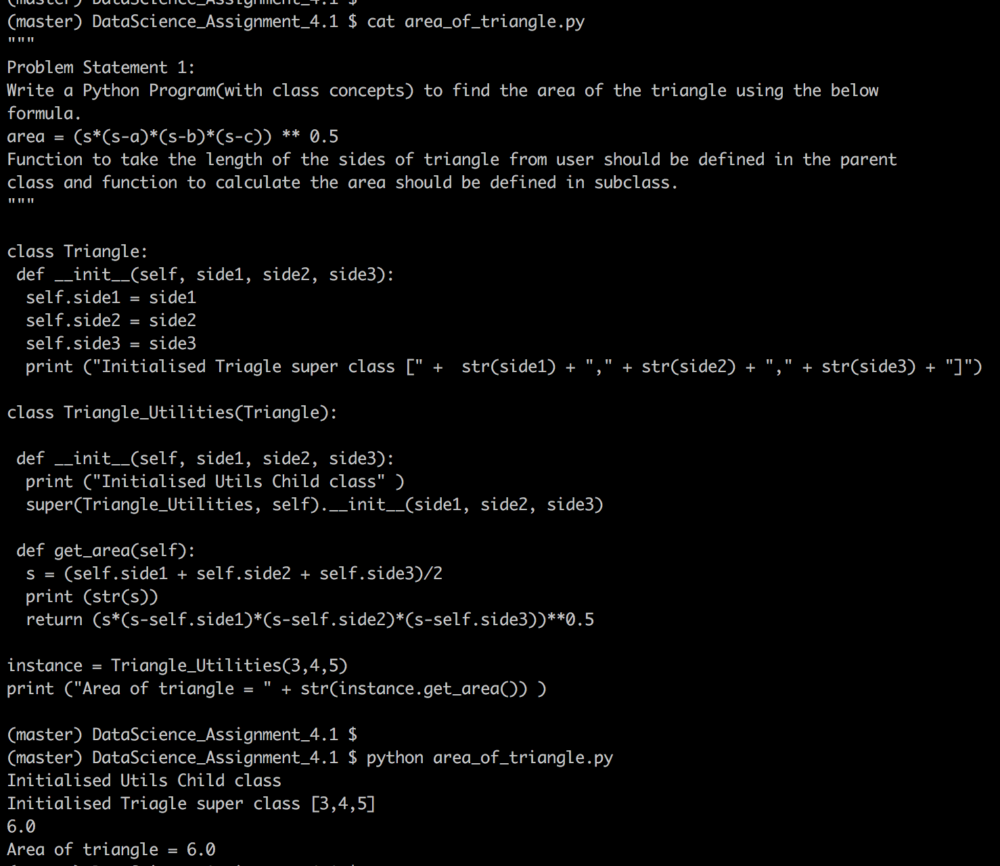
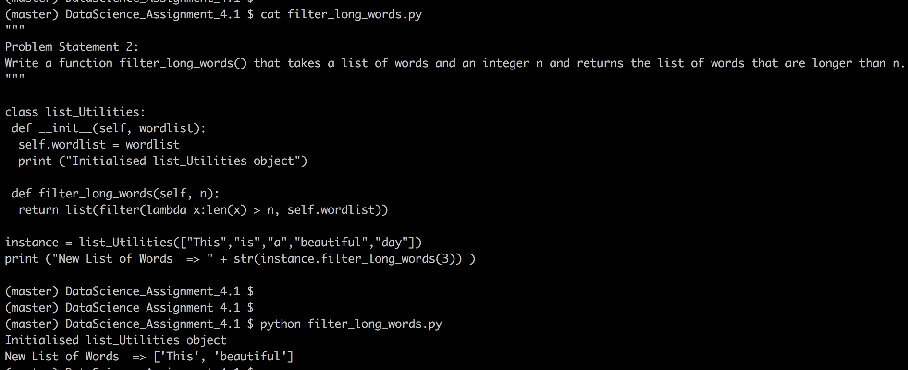

# Problem Statement :
```
#### Problem Statement​ ​1:
 to find the area of the triangle using the below
formula.
area = (s*(s-a)*(s-b)*(s-c)) ** 0.5
Function to take the length of the sides of triangle from user should be defined in the parent
class and function to calculate the area should be defined in subclass.")
#### Problem Statement​ ​2:
 that takes a list of words and an integer n and returns the list
of words that are longer than n.")
```

## Snapshot - class concepts implementation






